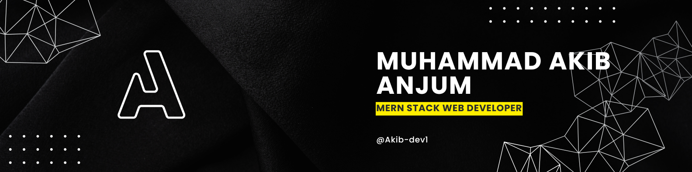

  

# 💫 About Me:
I am a passionate **MERN Stack Developer** with a solid foundation in front-end and back-end development. With hands-on experience in HTML, CSS, JavaScript, Tailwind CSS, React.js, Node.js, Express.js, and MongoDB, I specialize in building full-stack web applications that are responsive, scalable, and secure. I also integrate Firebase for real-time features and authentication, and implement JWT for robust user authorization.  Beyond web development, I have a working knowledge of Java and C++, giving me a strong grasp of object-oriented programming and data structures, which I apply to solve complex problems efficiently.  I'm always eager to learn and stay updated with the latest technologies to build innovative solutions and deliver high-quality user experiences.

# 🙋‍♂️ Name  
<h3>Muhammad Akib Anjum</h3>

## 👨‍💼 Designation:
**MERN Stack Developer**

## 🌐 Socials:
 
 
 

# 💻 Tech Stack:
 
 
 
 
 
 
 
 
 
 
 
 
 
 
 
 

# 📊 GitHub Stats:
 
 

## 🏆 GitHub Trophies

### ✍️ Quote

### 🔝 Top Contributed Repo

---

<!-- Proudly created with GPRM ( https://gprm.itsvg.in ) -->
